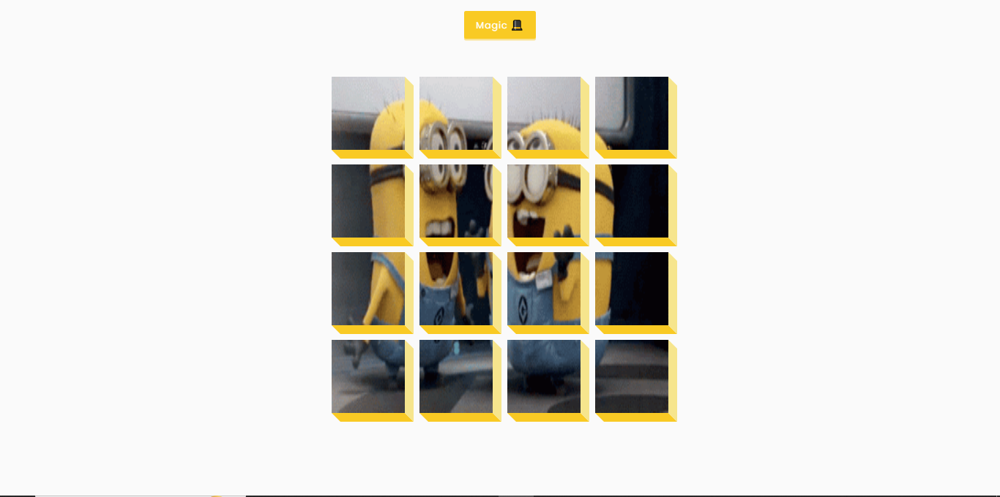

# 🐶 TinDog Website Project

TinDog is a responsive and stylish landing page for a fictional dog dating app. Inspired by modern web design, this project uses HTML, CSS, and Bootstrap to create a visually engaging website.

## 🔗 Live Demo

👉 [Click here to view the TinDog Website](https://selvarajan-m.github.io/TinDog/)

## 📂 Project Repository

🔗 [GitHub Repository](https://github.com/Selvarajan-M/TinDog)

## 🧰 Tech Stack

- **HTML5**
- **CSS3**
- **Bootstrap 4**
- **Git & GitHub** – for version control and hosting

## ✨ Features

- Fully responsive layout
- Clean, modern, and mobile-friendly design
- Bootstrap grid and components used for layout and styling

## 🚀 How to Run Locally

1. **Clone the repository**:
   ```bash
   git clone https://github.com/Selvarajan-M/TinDog.git
   ```

2. **Navigate to the folder**:
   ```bash
   cd TinDog
   ```

3. **Open `index.html` in your browser**

> ✅ No backend or setup required.

## 📸 Screenshot



## 👨‍💻 Author

**Selvarajan M**  
GitHub: [@Selvarajan-M](https://github.com/Selvarajan-M)

---

⭐️ If you liked this landing page, consider starring the repository!
